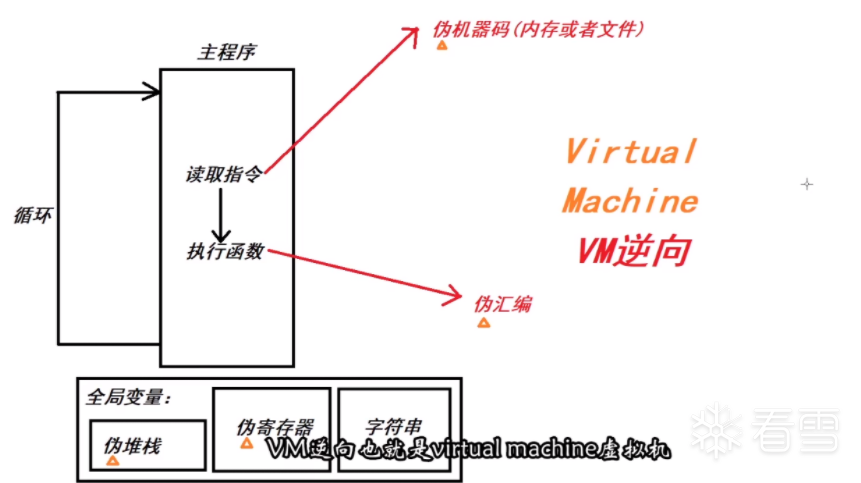
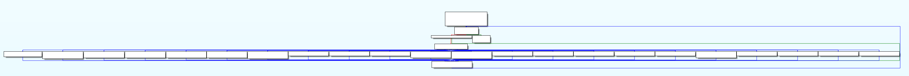

# ezvm

> 比较ez的vm 虚拟机初探

[原链接【NSSCTF】ezvm](https://www.nssctf.cn/problem/1886)

[文件](./assets/bin/ezvm.exe){:download="ezvm.exe"}

# 前置知识

参考：[*【看雪论坛】对VM逆向的分析(CTF)*](https://bbs.kanxue.com/thread-267670.htm)

## 简单的vm-re框架



虚拟机就是要去模仿一个机器，让机器去执行一个文件

它需要寄存器和堆栈，模拟一个CPU不断去读取指令——以循环的形式

1.在全局变量中分配如下内容：

- 伪堆栈
- 伪寄存器
- 字符串

这里就构成了CPU+内存
 
2.模拟一个CPU读取指令的形式(dispatcher)去写主程序

不断的去读取存在于内存中或文件中的指令(伪 机器码*opcode*)，然后执行指令opcode所对应的一些函数(其实这些函数可以理解为伪汇编的执行过程，比如就像一些add,sub,pop,push,jmp等操作)，这样下来就可以与真实的程序执行相差无几

## 目标

把所有伪opcode全部分析出来

# 分析

*搜集线索，分析opcode*



*图：巨大的switch*

```c
while ( 1 )
{
    v3 = dword_49F020[dword_49F020[0] + 109];
    if ( v3 == -1 )
    return 0;
    switch ( v3 )
    {
```

根据 `v3` 来 `switch` 要执行的函数，可知这里 `v3` 就是 opcode，那么 `dword_49F020[dword_49F020[0] + 109]` 就是 `opcode_list`，

`dword_49F020[0]` 大概率是 `vm_eip`

动态调试，找到`opcode_list`对应位置，然后 idapython dump 下来，脚本如下

```python
start = 0x49F1D4
end = 0x49F2D8 # 这里全是FFFF，就是终点

result = []
for i in range(start, end, 4):
    cmd_index = get_wide_dword(i)
    result.append(hex(cmd_index))
    
print(','.join(result))

# 结果
"""
0x12,0x8,0x12,0x9,0x10,0x4,0x1,0xf,0xd,0x2,0x12,0x8,0x12,0x9,0x0,0x4,0xf,0xd,0x12,0x9,0x12,0xa,0x13,0x12,0xb,0x15,0x3,0x14,0x1,0x0,0xf,0xd,0x12,0xa,0x12,0x12,0x12,0x8,0x13,0xf,0x7,0x4,0x9,0xd,0x9,0x8,0x5,0x6,0x4,0x1,0x0,0xf,0xd,0x12,0x9,0x12,0x8,0x12,0xa,0x12,0x7,0xf,0xc,0x11,0xe
"""
```

在每次opcode执行结束，vm_eip一定会增加，所以 `dword_49F020` 就是 vim_eip

类似的，一点一点分析，最后得到伪寄存器的结构体、解析脚本

```c
#include<stdint.h>

struct vm
{
    int32_t vm_eip; // 虚拟机的EIP指针 49F020
    int32_t vm_esp; // 虚拟机的ESP指针，栈帧
    int32_t vm_eax; // dword_49F028
    int32_t vm_ebx; // dword_49F02C
    int32_t vm_ecx; // dword_49F030
    int32_t vm_edx; // dword_49F034
    int32_t vm_esi; // dword_49F038
    int32_t vm_edi; // dword_49F03C
    int32_t vm_sign_flag; // sign指令之后，结果存放在这里
};
```

```python
opcode_table = {
    0x0: "mov ebx, eax",
    0x1: "inc eax",
    0x2: "dec eax",
    0x3: "xor ebx, edi",
    0x4: "push ebx",
    0x5: "push edx",
    0x6: "push esi",

    0x7: "pop ebx",
    0x8: "pop edx",
    0x9: "pop esi",
    0xa: "pop eax",
    0xb: "pop edi",

    0xc: "jz vm_sign_flag, esi",
    0xd: "jnz vm_sign_flag, esi",

    0xe: "jmp eax",
    0xf: "sign ebx, edx",
    0x10: "getchar ebx",
    0x11: "putchar ebx",
    0x12: "pfm ecx",

#   push [pop from memery]
#   即 esp++, [vm + esp + 6] = [vm + ecx + CDh], ecx++
#   只有这里的数据是未知的，所以在这里打断点，然后dump出数据

    0x13: "mov ebx, vm[ax+9]",
    0x14: "mov vm[ax+9], bx",
    0x15: "add ebx, ebx"
}

def dump():
    """这段脚本扔到ida里运行，dump出数据段"""
    start = 0x49F364
    end = 0x49F4AC # 后面全是0，就是终点

    result = []
    for i in range(start, end, 4):
        cmd_index = get_wide_dword(i)
        result.append(hex(cmd_index))
        
    print(','.join(result))

data_dump = [0xa,0xfffffffb,0x20,0x2f,
            0xfffffff6,0x0,0x5e,0x46,
            0x61,0x43,0xe,0x53,
            0x49,0x1f,0x51,0x5e,
            0x36,0x37,0x29,0x41,
            0x63,0x3b,0x64,0x3b,
            0x15,0x18,0x5b,0x3e,
            0x22,0x50,0x46,0x5e,
            0x35,0x4e,0x43,0x23,
            0x60,0x3b,0x0,0xffffffef,
            0x15,0x8e,0x88,0xa3,0x99,0xc4,0xa5,0xc3,0xdd,0x19,0xec,0x6c,0x9b,0xf3,0x1b,0x8b,0x5b,0x3e,0x9b,0xf1,0x86,0xf3,0xf4,0xa4,0xf8,0xf8,0x98,0xab,0x86,0x89,0x61,0x22,0xc1,0x2,0x0,0xfffffffa,0x73,0x75,0x63,0x63,0x65,0x73]

opcode_list = [0x12,0x8,0x12,0x9,0x10,0x4,0x1,0xf,0xd,0x2,0x12,0x8,0x12,0x9,0x0,0x4,0xf,0xd,0x12,0x9,0x12,0xa,0x13,0x12,0xb,0x15,0x3,0x14,0x1,0x0,0xf,0xd,0x12,0xa,0x12,0x12,0x12,0x8,0x13,0xf,0x7,0x4,0x9,0xd,0x9,0x8,0x5,0x6,0x4,0x1,0x0,0xf,0xd,0x12,0x9,0x12,0x8,0x12,0xa,0x12,0x7,0xf,0xc,0x11,0xe]

for opcode_index in opcode_list:
    print(opcode_table[opcode_index])
```

然后伪汇编指令如下

```asm
00 pfm ecx 
01 pop edx ; 0x0A，换行符
02 pfm ecx
03 pop esi ; -5
04 getchar ebx
05 push ebx
06 inc eax ; 计算长度
07 sign ebx, edx
08 jnz vm_sign_flag, esi

09 dec eax
0a pfm ecx 
0b pop edx ; 0x20
0c pfm ecx
0d pop esi ; 0x2f
0e mov ebx, eax ; 长度转移
0f push ebx
10 sign ebx, edx
11 jnz vm_sign_flag, esi ; 如果长度不相等，就退出，所以长度是 0x20

12 pfm ecx
13 pop esi ; -10
14 pfm ecx
15 pop eax ; 0x00
16 mov ebx, vm[ax+9] ; 即从栈底开始获取数据
17 pfm ecx
18 pop edi ; 0x5e
19 add ebx, ebx ; * 2
1a xor ebx, edi ; 异或
1b mov vm[ax+9], bx ; 然后存回去
1c inc eax 

1d mov ebx, eax
1e sign ebx, edx
1f jnz vm_sign_flag, esi ; 判断下标是否超过长度

20 pfm ecx
21 pop eax ; 0x00
22 pfm ecx ; -17
23 pfm ecx ; 0x15
24 pfm ecx ; 0x8e

25 pop edx ; 0x8e
26 mov ebx, vm[ax+9] ; 从栈底开始
27 sign ebx, edx 检测 是否等于edx
28 pop ebx ; 0x15
29 push ebx ; 0x15
2a pop esi ; 0x15
2b jnz vm_sign_flag, esi ; 不相等就扔出去，eip + 0x15
2c pop esi -17
2d pop edx 
2e push edx
2f push esi
30 push ebx
31 inc eax
32 mov ebx, eax
33 sign ebx, edx
34 jnz vm_sign_flag, esi
35 pfm ecx
36 pop esi
37 pfm ecx
38 pop edx
39 pfm ecx
3a pop eax
3b pfm ecx
3c pop ebx
3d sign ebx, edx
3e jz vm_sign_flag, esi
3f putchar ebx
40 jmp eax
```

最后分析出来，就是个异或+除法加密

## EXP

```python
xor_table = [0x5e,0x46,
            0x61,0x43,0xe,0x53,
            0x49,0x1f,0x51,0x5e,
            0x36,0x37,0x29,0x41,
            0x63,0x3b,0x64,0x3b,
            0x15,0x18,0x5b,0x3e,
            0x22,0x50,0x46,0x5e,
            0x35,0x4e,0x43,0x23,
            0x60,0x3b,0x0, 0x0]

enc_flag = [0x8e, 0x88,0xa3,0x99,0xc4,0xa5,0xc3,0xdd,0x19,0xec,0x6c,0x9b,0xf3,0x1b,0x8b,0x5b,0x3e,0x9b,0xf1,0x86,0xf3,0xf4,0xa4,0xf8,0xf8,0x98,0xab,0x86,0x89,0x61,0x22,0xc1,0x2,0x0]

print(len(enc_flag))

result = ''
for i in range(len(enc_flag)):
    result += chr((enc_flag[i] ^ xor_table[i]) // 2)

print(result)

# hgame{Ea$Y-Vm-t0-PrOTeCT_cOde!!}
```

# 参考资料

[【52pojie】总结idapython在逆向中的应用](https://www.52pojie.cn/thread-1117330-1-1.html)

这篇文章基本所有idapython的用法都涵盖到了，不过有些用法在python3无法使用，需要再参考这篇：[【博客园】基于IDA7.5_Python3](https://www.cnblogs.com/iBinary/p/14642662.html)

[【看雪论坛】对VM逆向的分析(CTF)](https://bbs.kanxue.com/thread-267670.htm)

题目类似，这个就是解题的基本思路了，但是还是要肝，是个苦力活

[【知乎】NCTF2023 逆向题目ezVM 题解](https://zhuanlan.zhihu.com/p/675243789)

这个是用Frida暴力破解方法，可以看看，不过题目未给出一点提示信息，也不好爆破