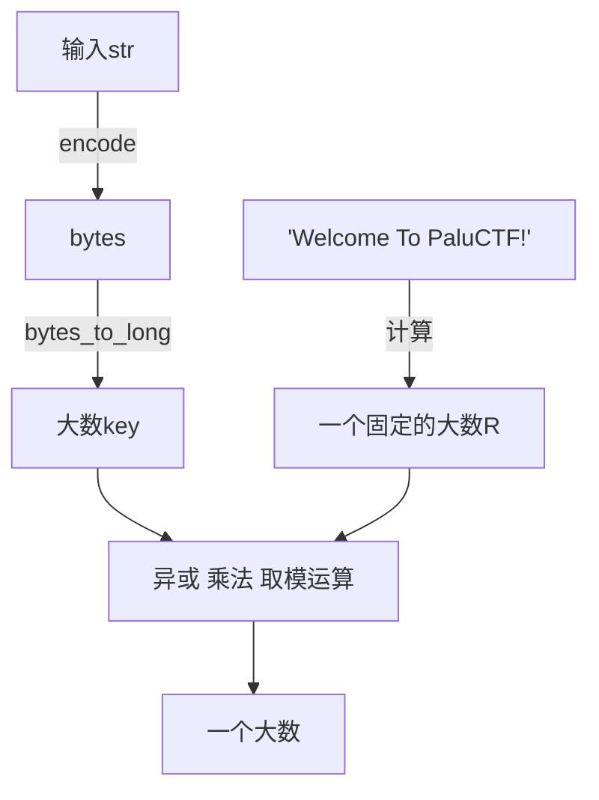

# 蟒蛇帕鲁

[文件](./assets/bin/PyLu.exe){:download="PyLu.exe"}

## 解包

看图标/扔进DIE，使用PyInstaller打包的，开始解包

- [pyinstxtractor](https://github.com/extremecoders-re/pyinstxtractor) 解包出 pyc
- [pycdc](https://github.com/zrax/pycdc) 解包出 py （之前用的 [Uncompyle6](https://github.com/rocky/python-uncompyle6) 不好使了，因为是用 3.11 打包的）

另外，这里的pycdc并没有给可执行文件，需要手动编译

- 安装 cmake
- `git clone https://github.com/zrax/pycdc.git`
- `cmake . msbuild pycdc.sln`
- 用 VS 打开，编译

已经把编译好的文件扔进[[Python工具和包|Python常用工具]]了

> 参考
>
> [【python逆向 pyc反编译】python逆向全版本通杀-CSDN博客](https://blog.csdn.net/zjjcxy_long/article/details/127346296)
> 
> [Decompiling recent python versions (up to 3.12) - Ring 0x00 (idafchev.github.io)](https://idafchev.github.io/blog/Decompile_python/)

## 分析

```python
from Crypto.Util.number import bytes_to_long

def enc(key):
    R = bytes_to_long(b'Welcome To PaluCTF!')
    MOD = 2 ** 418
    R = R ^ R - 60 >> 24
    R = R ^ R - 60 << 88
    R ^= key
    R = -R ** 2 * 2024 % MOD
    R = R * key % MOD
    return R

flag = input('Welcome To PaluCTF!\nInput FLAG:')
m = bytes_to_long(flag.encode())
cor = 0x2E441F765514CCA89173554726494D37E9FBE774B6F807BC5F6E71117530CE3D7DB5F70554C03CD9055F4E42969600904DF1F4DB8L
if enc(m) == cor:
    print('Congratulation!')
    return None
print('Wrong FLAG!')
```

稍微修改下代码，使得可读性提高一些

```python
def enc(key):
    R = bytes_to_long(b'Welcome To PaluCTF!')
    MOD = 2 ** 418
    R = R ^ ((R - 60) >> 24)
    R = R ^ ((R - 60) << 88)
    # 此时 hex(R) # 0x57656c340a01064f390a00536b201128393569390a00040e4c2522383362

    KeyXor = key ^ R
    temp = (KeyXor ** 2) * (key)
    R = ((-(temp)) * 2024) % MOD
    return R

flag = input()
m = bytes_to_long(flag.encode())
cor = 0x2E441F765514CCA89173554726494D37E9FBE774B6F807BC5F6E71117530CE3D7DB5F70554C03CD9055F4E42969600904DF1F4DB8
if enc(m) == cor:
    print('Congratulation!')
    exit()
print('Wrong FLAG!')
```

所以算法是



以上算法因为带有==异或/平方/取模/乘法==运算，导致很难找到逆运算，

但是另外，这些运算并没有改变各个位的位置，这意味着我们可以从个位开始，逐位爆破

# EXP

```python
from Crypto.Util.number import bytes_to_long
from string import printable

cor = 0x2E441F765514CCA89173554726494D37E9FBE774B6F807BC5F6E71117530CE3D7DB5F70554C03CD9055F4E42969600904DF1F4DB8

def enc(key):
    R = bytes_to_long(b'Welcome To PaluCTF!')
    MOD = 2 ** 418
    R = R ^ R - 60 >> 24
    R = R ^ R - 60 << 88
    R ^= key
    R = -R ** 2 * 2024 % MOD
    R = R * key % MOD
    return R

def find_next(current_str: str):
    print(current_str)
    length = len(current_str)
    if (cor >> (length * 8)) == 0:
        return current_str

    for c in printable:
        s = (c + current_str)
        e = enc(bytes_to_long(s.encode()))
        if (e >> (length * 8)) & 0xFF == cor >> (length * 8) & 0xFF:
            r = find_next(c + current_str)
            if r == None:
                continue
            else:
                return r
    
    return None

find_next("")
```

# EXP2

看了下第一名的wp，用到了z3

[Z3官方文档 | Introduction | Online Z3 Guide (microsoft.github.io)](https://microsoft.github.io/z3guide/programming/Z3%20Python%20-%20Readonly/Introduction/)

[Z3基础学习（一） 从例子入门](https://www.cnblogs.com/myx-myx/articles/17009330.html)

[帕鲁杯 Writeup (yuque.com)](https://www.yuque.com/yuro/rueylp/hu91xww3olyp8h04#cTDNV)

```python
import z3
from Crypto.Util.number import *

def enc(key):
    R = bytes_to_long(b"Welcome To PaluCTF!")
    MOD = 2**418
    R = R ^ ((R - 60) >> 24)
    R = R ^ ((R - 60) << 88)
    R ^= key
    R = (-R * R * 2024) % MOD  
    R = (R * key) % MOD
    return R

res = 0x2E441F765514CCA89173554726494D37E9FBE774B6F807BC5F6E71117530CE3D7DB5F70554C03CD9055F4E42969600904DF1F4DB8
solver = z3.Solver()
key = z3.BitVec("key", 418)
solver.add(enc(key) == res)
solver.check()
m = solver.model()
flag = long_to_bytes(m[key].as_long())
print(flag)
```

太抽象了