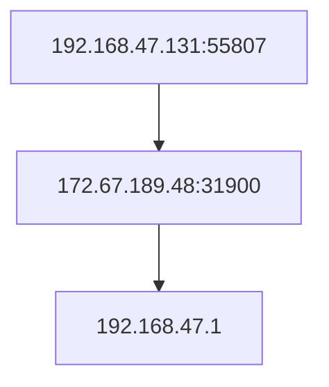

[新建虚拟机（.vmdk）导入Vmware - 酒大暗 - 博客园 (cnblogs.com)](https://www.cnblogs.com/lxml/p/13879978.html)

Login使用root

![[image-20240425195620825.png]]

[Linux系统 tcpdump 抓包命令使用教程 - 知乎 (zhihu.com)](https://zhuanlan.zhihu.com/p/74812069)

```text
tcpdump -XX # 查看以16进制和ASCII吗形式显示每个报文（包含链路层报头）。
```

![[image-20240425200019920.png]]

flag{Ur_s3rVer_1s_n0w_mY_p4l}

![[image-20240425200240626.png]]

# 2 溯源

[Vmware虚拟机命令安装 Vmware Tools_sudo apt-get autoremove open-vm-tools sudo apt-get-CSDN博客](https://blog.csdn.net/m0_46259216/article/details/122442959#:~:text=Vmware%E8%99%9A%E6%8B%9F%E6%9C%BA%E5%91%BD%E4%BB%A4%E5%AE%89%E8%A3%85%20Vmware%20Tools%201%20sudo%20apt-get%20autoremove%20open-vm-tools,install%20open-vm-tools-desktop%203%20sudo%20reboot%20%20%2F%2F%20%E9%87%8D%E5%90%AF%E7%94%B5%E8%84%91)

```shell
sudo apt-get open-vm-tools
sudo apt-get install open-vm-tools-desktop
sudo reboot // 重启电脑
```

[parted扩展磁盘分区（实践篇）_parted分区扩容-CSDN博客](https://blog.csdn.net/tiny_du/article/details/119385030)

[grayddq/GScan: 本程序旨在为安全应急响应人员对Linux主机排查时提供便利，实现主机侧Checklist的自动全面化检测，根据检测结果自动数据聚合，进行黑客攻击路径溯源。 (github.com)](https://github.com/grayddq/GScan)

`/etc/shadow` 文件存在异常

![[image-20240425203231844.png]]

![[image-20240425203930990.png]]

linux.55807

ss命令 [如何检查 Debian 上的开放端口 (linux-console.net)](https://cn.linux-console.net/?p=29513)

```
ss -ulp

udp   ESTAB  0      0                    192.168.47.131:55807     172.67.189.48:31900
1```
traceroute 172.67.189.48


```log
 1  _gateway (192.168.47.2)  0.165 ms  0.084 ms  0.056 ms
 2  * * *
 3  * * *
```

```log
who-has _gateway
```

不就是 172.67.189.48 —— 一个美国的节点

[IP地址查询 - 在线工具 (tool.lu)](https://tool.lu/ip/)

所以发包路径是：



`ip addr` 查看本地ip，即 `192.168.47.131`

看看这个端口 `55807` 是哪个程序占用的

```shell
lsof -i

```

![[image-20240425211831893.png]]

`46912 -> _gateway:domain`

看了下 `systemd-resolve` 是改 dns 的

[优化ubuntu dns解析，关掉systemd-resolved - MR__Wang - 博客园 (cnblogs.com)](https://www.cnblogs.com/xzlive/p/17139520.html)

```shell
cat /etc/resolv.conf

##########################
nameserver 192.168.47.2
search localdomain
```

[Linux配置/etc/resolv.conf详解 - yuhaohao - 博客园 (cnblogs.com)](https://www.cnblogs.com/yuhaohao/p/13889240.html)

nameserver 是 dns 服务器

![[image-20240425213705262.png]]

```log
traceroute _gateway

traceroute to _gateway(192.168.47.2)...
```

所以 dns 把 `_gateway` 域名解析到了 192.168.47.2

![[image-20240425213943375.png]]

`gateway.5335` ，看看这个端口

![[image-20240425214117763.png]]

看来就是这个 `systemd-resolve`

```log
systemd+     494  0.0  0.6  20824 13040 ?        Ss   12:22   0:00 /lib/systemd/systemd-resolved
```

```log
systemd-resolved --help

/lib/systemd/systemd-resolved [OPTIONS...]

Provide name resolution with caching using DNS, mDNS, LLMNR.

This program takes no positional arguments.

Options:
  -h --help                 Show this help
     --version              Show package version
     --bus-introspect=PATH  Write D-Bus XML introspection data

See the systemd-resolved.service(8) man page for details.

```

```shell
apt install net-tools
```

![[image-20240425221308956.png]]

[netstat 命令不显示进程号进程名，只显示横线 '-'_netstat看不到进程名-CSDN博客](https://blog.csdn.net/guangyacyb/article/details/97106186)

尝试把DNS改了

```
vim /etc/resolv.conf
```

![[image-20240425225523945.png]]

这个端口

[如何在Linux命令行下发送和接收UDP数据包 - whowin - 发表我个人原创作品的技术博客 (gitee.io)](https://whowin.gitee.io/post/blog/network/0005-send-udp-via-linux-cli/)

/sbin/init
/lib/systemd/systemd-udevd
/lib/systemd/systemd-timesyncd
/usr/bin/VGAuthService
/usr/bin/vmtoolsd

root         732  0.0  0.1 168140  2956 ?        S    12:23   0:00 (sd-pam)

直接搜 sd-pam，好像是个挖矿脚本，pid是732

[云服务器反黑客入侵攻防实录（一） - 清如许99 - 博客园 (cnblogs.com)](https://www.cnblogs.com/solomonxu/p/10889928.html)

[unhide 搜索隐藏进程和 TCP/UDP 端口——通过修改加载的so文件来实现隐藏，待研究实现思路 - bonelee - 博客园 (cnblogs.com)](https://www.cnblogs.com/bonelee/p/15939406.html)

[linux隐藏病毒处理（top查询us占用70%左右，却没有CPU高使用的进程）_top命令us很高但没进程-CSDN博客](https://blog.csdn.net/w50feng/article/details/107034335)

重开个虚拟机，扫一下所有程序

[Linux Find命令查找指定时间范围内的文件的例子 - 简书 (jianshu.com)](https://www.jianshu.com/p/4d06acb4e61e)

```bash
find / -mtime +3 -type f -print # 三天“以前”改过的文件
find / -mtime -3 -type f -print # 三天“内”改过的文件
find / -type f -newermt '2024-2-10' ! -newermt '2024-04-25' # 指定时间

# 时间中的命令：m: Modify c: Change b: Birth a: Access
```

[linux - 查找指定时间的文件及文件中的关键字 - Alive_2020 - 博客园 (cnblogs.com)](https://www.cnblogs.com/sunxiuwen/p/12896271.html)

```shell
find . -type f -ctime -1| xargs ls –l 
```

- `-type f` 指文件
- `ctime` c:change
- ctime参数指文件日期等状态性参数修改，mtime参数指内容改变：

![[image-20240426081532493.png]]

stat命令查看详细信息

2024-02-12 到 2024-04-25

![[image-20240426082408119.png]]

`find / -name "*.py" | less`

![[image-20240426082848009.png]]

```shell
find / -type f -newermt '2024-2-11 4:35:00' ! -newermt '2024-04-25' # 有输出
find / -type f -newermt '2024-2-11 4:36:00' ! -newermt '2024-04-25' # 无输出
```

说明装了Python库之后就没动，没啥关系

从 2024-02-11 5:35:00 开始的

![[image-20240426083732490.png]]


[linux挖矿进程，隐藏CPU——用top、ps等命令却一直找不到是哪个进程在占用，todo，待深入 - bonelee - 博客园 (cnblogs.com)](https://www.cnblogs.com/bonelee/p/16976768.html)

```shell
cat /proc/net/udp
```

![[image-20240426090406089.png]]

```shell
#!/bin/bash

# 遍历/proc/下的所有数字文件夹（进程文件夹）
for pid_dir in /proc/[0-9]*/; do
    pid=$(basename "$pid_dir")  # 提取进程ID

    # 检查进程文件夹下的fd子文件夹是否存在
    if [ -d "$pid_dir"fd ]; then
        # 遍历进程的fd子文件夹中的所有文件
        for fd_file in "$pid_dir"fd/*; do
            # 检查文件是否是一个socket
            if file "$fd_file" | grep -q "socket"; then
                # 输出该进程ID（进程号）
                echo "Process $pid has a socket open:"
                cat "$pid_dir"cmdline  # 输出进程的命令行
                echo "---"
                break  # 找到一个socket后就退出当前进程的fd文件夹遍历
            fi
        done
    fi
done
```

![[image-20240426091635336.png]]

`cat /proc/net/udp` 看看是哪个端口

![[image-20240426091858039.png]]

`本地 99A2(39330) -> 远程 7C9C(31900)`

![[image-20240426093945517.png]]

[Linux iptables命令详解-CSDN博客](https://blog.csdn.net/daocaokafei/article/details/115091313)

```shell
# 添加防火墙
sudo iptables -A INPUT -s 172.67.189.48 -j DROP
```

尝试建立端口，看看是否被占用

[Linux发送udp/tcp包最简单方法-netcat_linux发送udp包-CSDN博客](https://blog.csdn.net/yiyuzhan6325/article/details/121237362)

```shell
apt install ncat
nc -v -n -l 192.168.47.131 39330
```

![[image-20240426095858425.png]]

并没有被占用，奇怪了

试试发包

```shell
nc -v 172.67.189.48 31900
```

试试转发到这个端口

```shell
vim /etc/sysctl.conf
net.ipv4.ip_forward=1
sysctl -p
sudo iptables -t nat -A PREROUTING -p udp --dport 39330 -j DNAT --to-destination 172.67.189.48:31900
sudo iptables -t nat -A POSTROUTING -p udp -d 172.67.189.48 --dport 31900 -j SNAT --to-source 192.168.47.131:11451
# 查看当前规则
sudo iptables -L -n -t nat
```

`tail -f 文件`

改端口了 39304

知道了，尝试连接 `nc -v 172.67.189.48 31900` 连接超时，所以没有建立连接，所以是看不到进程的，想办法转发一下ip然后搭个服务器

127.0.0.1:39304 -> 172.67.189.48:31900
如何转发这个包到127.0.0.1:11451

![[image-20240426103309485.png]]

gpt

```shell
sysctl -w net.ipv4.ip_forward=1
iptables -t nat -N MYCHAIN
iptables -t nat -A OUTPUT -p tcp -s 192.168.47.131 --sport 39304 -d 172.67.189.48 --dport 31900 -j MYCHAIN
iptables -t nat -A MYCHAIN -p tcp -j REDIRECT --to-port 11451
sudo iptables -t nat -L # 查看当前状态
```

[iptables实现IP地址重定向（转发） - EasonJim - 博客园 (cnblogs.com)](https://www.cnblogs.com/EasonJim/p/7589394.html)

```shell
iptables -t nat -A OUTPUT -d 172.67.189.48 -p udp --dport 31900 -j DNAT --to-destination 192.168.47.131:11451
```

删除规则

```shell
sudo iptables -t nat -D PREROUTING 1
```

![[image-20240426105208343.png]]

```
nc -v -u -l 127.0.0.1 11451
# u 是 udp, l 是 listening
```

可以，收到了 

![[image-20240426105537819.png]]

但是还是看不到进程pwp

![[image-20240426105630807.png]]

192.168.47.132:59471

```shell
nc -v -u 172.67.189.48 31900 # udp 连接
```

测试了一下，udp是可以看到进程的，那就确定，就是程序主动隐藏了进程

![[image-20240426110343134.png]]

尝试遍历所有系统文件，作为file命令的输入，找到这个socket

![[image-20240426111256725.png]]

失败，隐藏了

# 进程隐藏

[应急响应之Linux下进程隐藏 - FreeBuf网络安全行业门户](https://www.freebuf.com/articles/network/258510.html)

![[image-20240426112443007.png]]

> screen `Ctrl + A -> Esc` 可以阅读模式

[（渗透测试后期）Linux进程隐藏详解_linux隐藏进程-CSDN博客](https://blog.csdn.net/qq_42882717/article/details/123777431)

![[image-20240426115521156.png]]

![[image-20240426125635959.png]]

/etc/.resolv.conf.systemd-resolved.bat

[技术|如何在 Linux/Unix/Windows 中发现隐藏的进程和端口](https://linux.cn/article-9288-1.html)

![[image-20240426130453454.png]]

![[image-20240426131736249.png]]

```shell
strace -o strace_ss.log ss -up
# 看看ss的调用情况
```

![[image-20240426131752070.png]]

![[image-20240426131856524.png]]

![[image-20240426132013173.png]]


![[image-20240426132606421.png]]

![[image-20240426133510497.png]]

上面这张图片很可疑，似乎是发送了一个包 `sendmsg` 然后 `recvmsg` 就收到了上面的本地ip和远程ip，但是pid一个是0一个是636521，直接看proc里面也没有636521

[getsockname()函数 Unix/Linux - Unix/Linux系统调用 (yiibai.com)](https://www.yiibai.com/unix_system_calls/getsockname.html)

```c
**int getsockname(int** _s_**, struct sockaddr ***_name_**, socklen_t ***_namelen_**);**
```

[Linux编程之recvmsg和sendmsg函数 - 季末的天堂 - 博客园 (cnblogs.com)](https://www.cnblogs.com/jimodetiantang/p/9190958.html)

636521

[【转】Linux下进程隐藏的常见手法及侦测手段_linux_xian_wwq-GitCode 开源社区 (csdn.net)](https://gitcode.csdn.net/65e6eb8d1a836825ed78817f.html)

```
专业一点话，使用一些系统完整性检查工具，比如tripwrie、aide等
```

[4.11. 使用 AIDE检查完整性 Red Hat Enterprise Linux 7 | Red Hat Customer Portal](https://access.redhat.com/documentation/zh-cn/red_hat_enterprise_linux/7/html/security_guide/sec-using-aide#:~:text=%E4%BD%BF%E7%94%A8%20AIDE%E6%A3%80%E6%9F%A5%E5%AE%8C%E6%95%B4%E6%80%A7%20%E9%AB%98%E7%BA%A7%E5%85%A5%E4%BE%B5%E6%A3%80%E6%B5%8B%E7%8E%AF%E5%A2%83%EF%BC%88%20Advanced,Intrusion%20Detection%20Environment%EF%BC%8C%E7%AE%80%E7%A7%B0%20AIDE%20%EF%BC%89%E6%98%AF%E4%B8%80%E4%B8%AA%E5%AE%9E%E7%94%A8%E5%B7%A5%E5%85%B7%EF%BC%8C%E5%AE%83%E5%8F%AF%E4%BB%A5%E5%88%9B%E5%BB%BA%E7%B3%BB%E7%BB%9F%E4%B8%8A%E7%9A%84%E6%96%87%E4%BB%B6%E6%95%B0%E6%8D%AE%E5%BA%93%EF%BC%8C%E7%84%B6%E5%90%8E%E5%88%A9%E7%94%A8%E8%AF%A5%E6%95%B0%E6%8D%AE%E5%BA%93%E6%9D%A5%E7%A1%AE%E4%BF%9D%E6%96%87%E4%BB%B6%E7%9A%84%E5%AE%8C%E6%95%B4%E6%80%A7%EF%BC%8C%E5%B9%B6%E6%A3%80%E6%B5%8B%E7%B3%BB%E7%BB%9F%E5%85%A5%E4%BE%B5%E3%80%82)

```shell
http://127.0.0.1:5244/p/ss
```

[systemctl命令列出所有服务_systemctl list-CSDN博客](https://blog.csdn.net/networken/article/details/107099861)

```shell
systemctl list-units --type=service --state=running
```

![[image-20240426142723721.png]]

cron 是计时任务，比如每日、每周，似乎也没什么

# 继续

[linux下进程隐藏的一些研究 - 先知社区 (aliyun.com)](https://xz.aliyun.com/t/11536?time__1311=mqmx0DBD2GG%3DY40vofDyADnAWGO85DcmP3D&alichlgref=https%3A%2F%2Fwww.google.com%2F)

