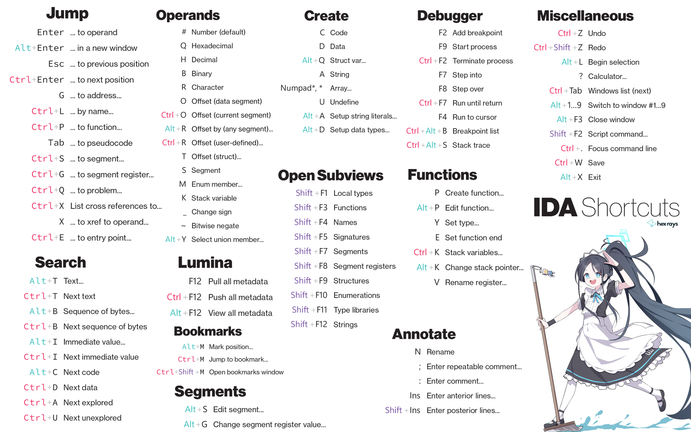

# IDA的糕集使用寄巧

## 快捷键

从官网扒下来 p了一下的图



[【看雪论坛】IDA技巧——结构体](https://bbs.kanxue.com/thread-266419.htm)

[IDA PRO 8.3 x86/x64/ARM/ARM64/MIPS/PPC/PPC64 (leakforum.io)](https://leakforum.io/Thread-IDA-PRO-8-3-x86-x64-ARM-ARM64-MIPS-PPC-PPC64)

### 基础

- **F5** 反编译 / 刷新反编译（patch或者应用结构体之后）
### 快照

- **Ctrl_Shift_W** 保存快照
- **Ctrl_Shift_T** 还原快照

### 标记

- **Alt_M** 打标机
- **Ctrl_M** 传送标记

### 结构体

1. **Shift_F1** 本地属性窗口
2. 按 **Insert** 以C语言语法定义结构体
3. **Ctrl_F** 搜索刚定义的结构体，双击导入结构体
4. 右键变量 -> `Convert to struct...`

### 结构体数组

1. **Alt_Q** 把第一个元素定义为结构体
2. **Shift_\*** 定义数组

### 扒数据

1. **Shift_E** 提取二进制数据
2. 在C代码界面 **R** ascii码转换成字符
3. **D** 把汇编指令转换成数字格式

### 函数

1. **E** 修改函数的结尾到当前位置
2. **Alt_P** 编辑函数的详细信息
3. **Alt_E_F_D** 删除函数定义 —— 其实就是模拟选择 Edit - Functions - Delete function

## idapython

[官方文档](https://hex-rays.com/products/ida/support/idapython_docs/)

### 使用pip装库

在IDA里执行，加个感叹号

```shell
!pip install xxx
```
## 设置

### 字体

IDA中的每一个工作区都可以设置自己的字体大小，选中工作区之后，点 Options - Fonts

#### 窗口调整

拖动子窗口的标题名，就可以把子窗口拖出来

把鼠标放在标题名的下面的灰色的条条，就可以单击拖回去

![[image-20240428175914810.png|400]]

### 显示汇编详细信息

Options - General - Disassembly

| 名称                    | 功能                   |
| --------------------- | -------------------- |
| Line Prefixed (Graph) | 在Graph中显示行号          |
| Stack pointer         | 显示栈指针，便于分析栈平衡        |
| Auto Comments         | 显示汇编命令描述             |
| Number of opcode...   | 显示机器码，0为不显示，非0设置显示宽度 |

## 调试

### 暂停法

如果程序有类似 `scanf` `getchar` ，就可以点击 `暂停` ，这样输入字符串之后，程序就会停在这些函数上，然后查看调用堆栈，就可以分析程序的关键部分

### Rebase

对于加载到内存中的so文件，如何找到对应函数是关键

等到内存中加载了对应的so文件之后，`Ctrl-S` 选择 `so` 最低地址的段，复制地址

复制一份so，再用IDA打开， `Edit -> Segments -> Rebase Program` 填上上面的地址，就不用每次都计算地址了